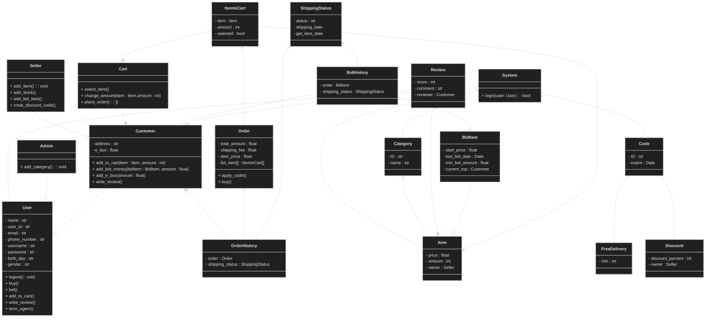

```mermaid
---
config:
  theme: dark
---

classDiagram
direction TB
    class User {
	    - name : str
	    - user_id : str
	    - email : str
	    - phone_number : str
	    - username : str
	    - password : str
	    - birth_day : str
	    - gender : str
	    + logout() void
	    + buy()
	    + bid()
	    + add_to_cart()
	    + write_review()
	    + term_ngern()
    }
    class Admin {
	    + add_category() : void
    }
    class Customer {
	    - address : str
	    - e_bux : float
	    + add_to_cart(item : Item, amount : int)
	    + add_bid_money(bidItem : BidItem, amount : float)
	    + add_e_bux(amount : float)
	    + write_review()
    }
    class Seller {
	    + add_item() : void
	    + add_stock()
	    + add_bid_item()
	    + creat_discount_code()
    }
    class Item {
	    - price : float
	    - amount : int
	    - owner : Seller
    }
    class Code {
	    - ID : str
	    - expire : Date
    }
    class Discount {
	    - discount_percent : int
	    - owner : Seller
    }
    class FreeDelivery {
	    - min : int
    }
    class Cart {
	    + select_item()
	    + change_amount(item : Item,amount : int)
	    + place_order() : []
    }
    class Order {
	    - total_amount : float
	    - shipping_fee : float
	    - item_price : float
	    - list_item[] : ItemInCart[]
	    + apply_code()
	    + buy()
    }
    class ItemInCart {
	    - item : Item
	    - amount : int
	    - selected : bool
    }
    class ShippingStatus {
	    - status : str
	    - shipping_date
	    - get_item_date
    }
    class OrderHistory {
	    - order : Order
	    - shipping_status : ShippingStatus
    }
    class BidHistory {
	    - order : BitItem
	    - shipping_status : ShippingStatus
    }
    class System {
	    + login(user: User) : bool
    }
    class Category {
	    - ID : str
	    - name : str
    }
    class Review {
	    - score : int
	    - comment : str
	    - reviewer : Customer
    }
    class BidItem {
	    - start_price : float
	    - last_bid_date : Date
	    - min_bid_amount : float
	    - current_top : Customer
    }
    System o-- User
    System o-- Item
    System o-- Category
    System o-- Code
    Admin --|> User
    Customer --|> User
    Seller --|> Customer
    Customer "1" *-- "*" OrderHistory
    Category "*" <-- "*" Item
    Code <|-- FreeDelivery
    Code <|-- Discount
    Cart --* Customer
    ItemInCart --* Cart
    ItemInCart <-- Order
    Order <-- OrderHistory
    ShippingStatus <-- OrderHistory
    Review "1" --* "*" Item
    BidItem --|> Item
    BidHistory --> BidItem
    BidHistory "1" --o "*" Customer
    ItemInCart --> Item
    Review --> Customer
    ShippingStatus <-- BidHistory

```
