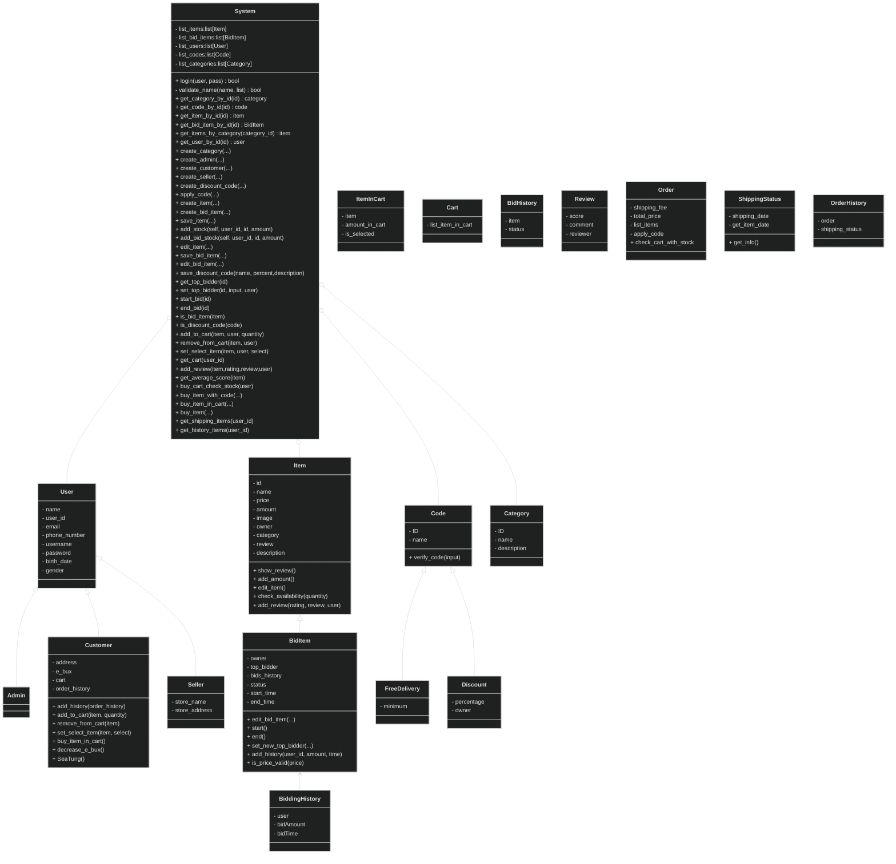

```mermaid
---
config:
  theme: dark
  look: classic
---
classDiagram
    class System{
        - list_items:list[Item]
        - list_bid_items:list[BidItem]
        - list_users:list[User]
        - list_codes:list[Code]
        - list_categories:list[Category]
        + login(user, pass)bool
        - validate_name(name, list)bool
        + get_category_by_id(id)category
        + get_code_by_id(id)code
        + get_item_by_id(id)item
        + get_bid_item_by_id(id)BidItem
        + get_items_by_category(category_id)item
        + get_user_by_id(id)user
        + create_category(...)
        + create_admin(...)
        + create_customer(...)
        + create_seller(...)
        + create_discount_code(...)
        + apply_code(...)
        + create_item(...)
        + create_bid_item(...)
        + save_item(...)
        + add_stock(self, user_id, id, amount)
        + add_bid_stock(self, user_id, id, amount)
        + edit_item(...)
        + save_bid_item(...)
        + edit_bid_item(...)
        + save_discount_code(name, percent,description)
        + get_top_bidder(id)
        + set_top_bidder(id, input, user)
        + start_bid(id)
        + end_bid(id)
        + is_bid_item(item)
        + is_discount_code(code)
        + add_to_cart(item, user, quantity)
        + remove_from_cart(item, user)
        + set_select_item(item, user, select)
        + get_cart(user_id)
        + add_review(item,rating,review,user)
        + get_average_score(item)
        + buy_cart_check_stock(user)
        + buy_item_with_code(...)
        + buy_item_in_cart(...)
        + buy_item(...)
        + get_shipping_items(user_id)
        + get_history_items(user_id)
    }
    class Item{
        - id
        - name
        - price
        - amount
        - image
        - owner
        - category
        - review
        - description
        + show_review()
        + add_amount()
        + edit_item()
        + check_availability(quantity)
        + add_review(rating, review, user)
    }
    class ItemInCart{
        - item
        - amount_in_cart
        - is_selected
    }
    class Cart{
        - list_item_in_cart
    }
    class User{
        - name
        - user_id
        - email
        - phone_number
        - username
        - password
        - birth_date
        - gender
    }
    class Admin{
    }
    User <|-- Admin
    class Customer{
        - address
        - e_bux
        - cart
        - order_history
        + add_history(order_history)
        + add_to_cart(item, quantity)
        + remove_from_cart(item)
        + set_select_item(item, select)
        + buy_item_in_cart()
        + decrease_e_bux()
        + SeaTung()
    }
    User <|-- Customer
    class Seller{
        - store_name
        - store_address
    }
    User <|-- Seller
    class BidHistory{
        - item
        - status
    }
    class BiddingHistory{
        - user
        - bidAmount
        - bidTime
    }
    class BidItem{
        - owner
        - top_bidder
        - bids_history
        - status
        - start_time
        - end_time
        + edit_bid_item(...)
        + start()
        + end()
        + set_new_top_bidder(...)
        + add_history(user_id, amount, time)
        + is_price_valid(price)
    }
    Item <|-- BidItem
    class Review{
        - score
        - comment
        - reviewer
    }
    class Code{
        - ID
        - name
        + verify_code(input)
    }
    class FreeDelivery{
        - minimum
    }
    Code <|-- FreeDelivery
    class Discount{
        - percentage
        - owner
    }
    Code <|-- Discount
    class Category{
        - ID
        - name
        - description
    }
    class Order{
        - shipping_fee
        - total_price
        - list_items
        - apply_code
        + check_cart_with_stock
    }
    class ShippingStatus{
        - shipping_date
        - get_item_date
        + get_info()
    }
    class OrderHistory{
        - order
        - shipping_status
    }

    System o-- Item
    System o-- User
    System o-- Code
    System o-- Category

    BidItem <-- BiddingHistory


```
