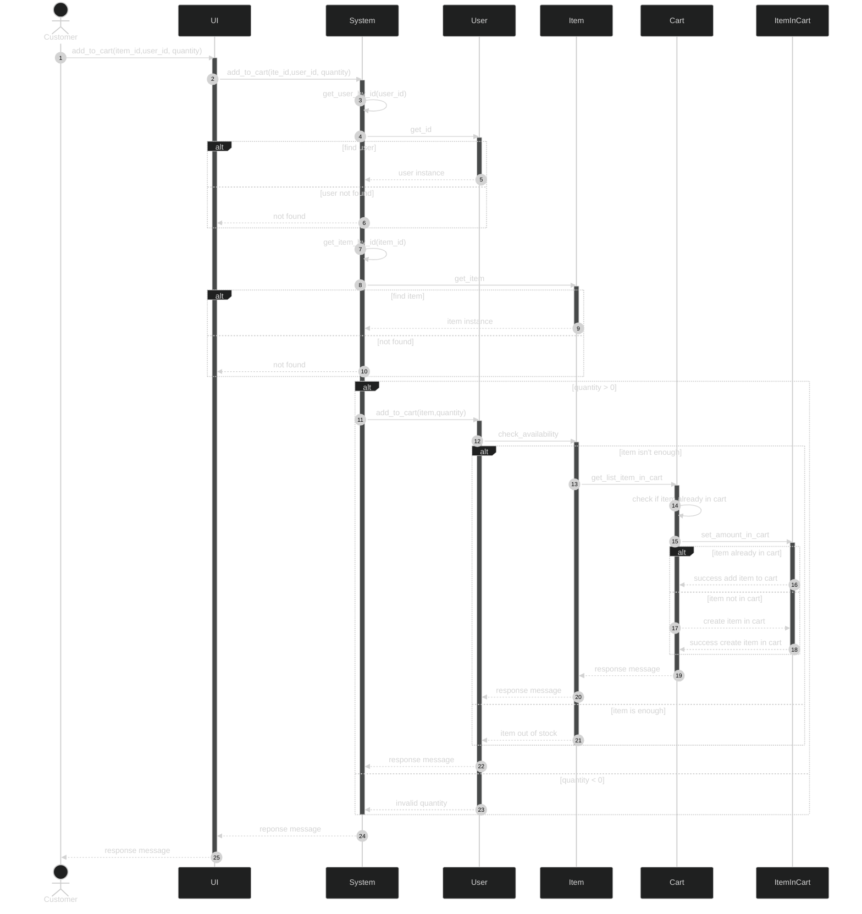

```mermaid
---
config:
  theme: dark
  look: classic
---

sequenceDiagram
autonumber

    actor Customer
    participant UI
    participant System
    participant User
    participant Item
    participant Cart
    participant ItemInCart

    Customer ->> UI: add_to_cart(item_id,user_id, quantity)
    activate UI
    UI ->> System: add_to_cart(ite_id,user_id, quantity)
    activate System
    System ->> System : get_user_by_id(user_id)
    System ->> User: get_id
    activate User
    alt find user
    User -->> System: user instance
    deactivate User
    else user not found
    System -->> UI : not found
    end
    System ->> System :get_item_by_id(item_id)
    System ->> Item: get_item
    activate Item
    alt find item
    Item -->> System:item instance
    deactivate Item
    else not found
    System -->> UI : not found
    end
    alt quantity > 0
    System ->> User: add_to_cart(item,quantity)
    activate User
    User ->> Item : check_availability
    activate Item
    alt item isn't enough
    Item ->> Cart: get_list_item_in_cart
    activate Cart
    Cart ->> Cart : check if item already in cart
    Cart ->> ItemInCart : set_amount_in_cart
    activate ItemInCart
    alt item already in cart
    ItemInCart -->> Cart : success add item to cart
    else item not in cart
    Cart -->> ItemInCart : create item in cart
    ItemInCart -->> Cart : success create item in cart
    deactivate ItemInCart
    end
    Cart -->> Item: response message
    deactivate Cart
    Item -->> User: response message
    else item is enough
    Item -->> User : item out of stock
    end
    deactivate Item
    User -->> System: response message
    else quantity < 0
    User -->> System: invalid quantity
    deactivate User
    end
    deactivate System
    System -->> UI : reponse message
    UI -->> Customer : response message
    deactivate UI
```
