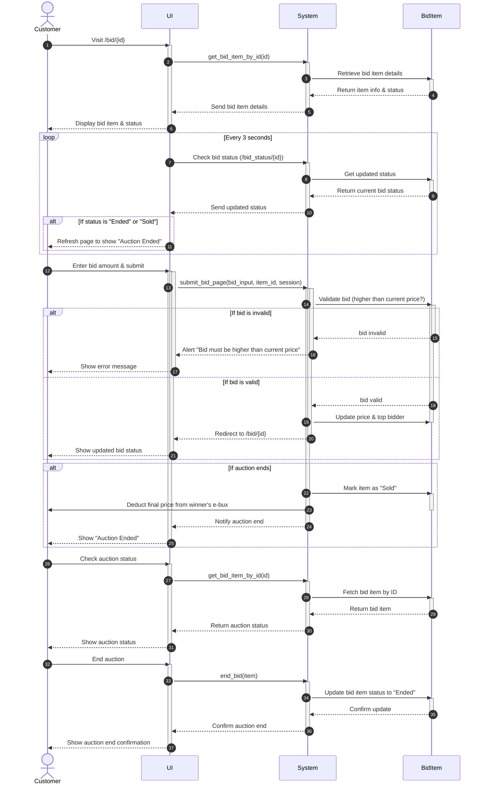

```mermaid
sequenceDiagram
  autonumber
  actor Customer as Customer
  participant UI as UI
  participant System as System
  participant BidItem as BidItem

  Customer->>UI: Visit /bid/{id}
  activate UI
  UI->>System: get_bid_item_by_id(id)
  activate System
  System->>BidItem: Retrieve bid item details
  activate BidItem
  BidItem-->>System: Return item info & status
  deactivate BidItem
  System-->>UI: Send bid item details
  deactivate System
  UI-->>Customer: Display bid item & status
  deactivate UI

  loop Every 3 seconds
    UI->>System: Check bid status (/bid_status/{id})
    activate System
    System->>BidItem: Get updated status
    activate BidItem
    BidItem-->>System: Return current bid status
    deactivate BidItem
    System-->>UI: Send updated status
    deactivate System
    alt If status is "Ended" or "Sold"
      UI-->>Customer: Refresh page to show "Auction Ended"
    end
  end

  Customer->>UI: Enter bid amount & submit
  activate UI
  activate UI
  activate UI
  UI->>System: submit_bid_page(bid_input, item_id, session)
  activate System
  activate System
  activate System
  System->>BidItem: Validate bid (higher than current price?)
  activate BidItem
  activate BidItem
  alt If bid is invalid
    BidItem-->>System: bid invalid
    deactivate BidItem
    System-->>UI: Alert "Bid must be higher than current price"
    deactivate System
    UI-->>Customer: Show error message
    deactivate UI
  else If bid is valid
    BidItem-->>System: bid valid
    System->>BidItem: Update price & top bidder
    deactivate BidItem
    System-->>UI: Redirect to /bid/{id}
    deactivate System
    UI-->>Customer: Show updated bid status
    deactivate UI
  end

  alt If auction ends
    System->>BidItem: Mark item as "Sold"
    activate BidItem
    System->>Customer: Deduct final price from winner's e-bux
    deactivate BidItem
    System-->>UI: Notify auction end
    deactivate System
    UI-->>Customer: Show "Auction Ended"
    deactivate UI
  end

  Customer->>UI: Check auction status
  activate UI
  UI->>System: get_bid_item_by_id(id)
  activate System
  System->>BidItem: Fetch bid item by ID
  activate BidItem
  BidItem-->>System: Return bid item
  deactivate BidItem
  System-->>UI: Return auction status
  deactivate System
  UI-->>Customer: Show auction status
  deactivate UI

  Customer->>UI: End auction
  activate UI
  UI->>System: end_bid(item)
  activate System
  System->>BidItem: Update bid item status to "Ended"
  activate BidItem
  BidItem-->>System: Confirm update
  deactivate BidItem
  System-->>UI: Confirm auction end
  deactivate System
  UI-->>Customer: Show auction end confirmation
  deactivate UI
```
