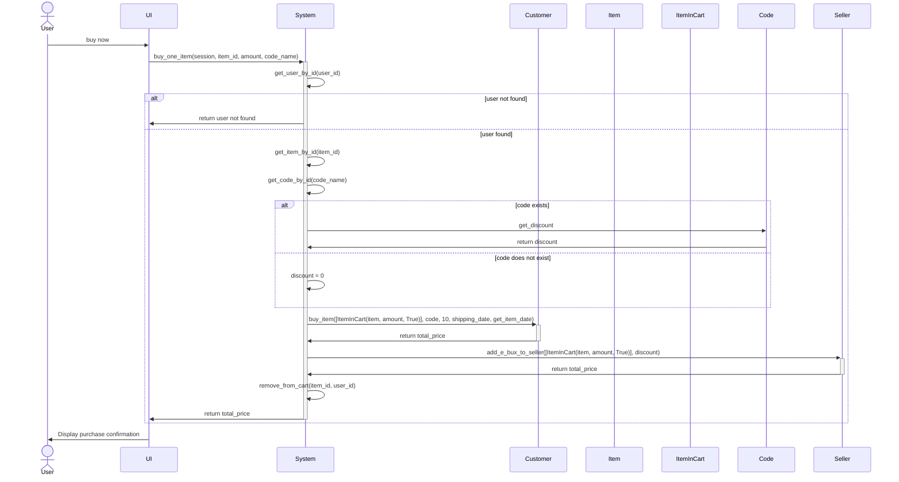

```mermaid

---
config:
  look: classic
---

sequenceDiagram
    actor User
    participant UI
    participant System
    participant Customer
    participant Item
    participant ItemInCart
    participant Code
    participant Seller
    User ->> UI: buy now
    UI ->>+ System: buy_one_item(session, item_id, amount, code_name)
    System ->> System: get_user_by_id(user_id)
    alt user not found
        System ->> UI: return user not found
    else user found
        System ->> System: get_item_by_id(item_id)
        System ->> System: get_code_by_id(code_name)
        alt code exists
            System ->> Code: get_discount
            Code ->> System: return discount
        else code does not exist
            System ->> System: discount = 0
        end
        System ->>+ Customer: buy_item([ItemInCart(item, amount, True)], code, 10, shipping_date, get_item_date)
        Customer ->>- System: return total_price
        System ->>+ Seller: add_e_bux_to_seller([ItemInCart(item, amount, True)], discount)
        Seller ->>- System: return total_price
        System ->> System: remove_from_cart(item_id, user_id)
        System ->>- UI: return total_price
    end
    UI ->> User: Display purchase confirmation

```