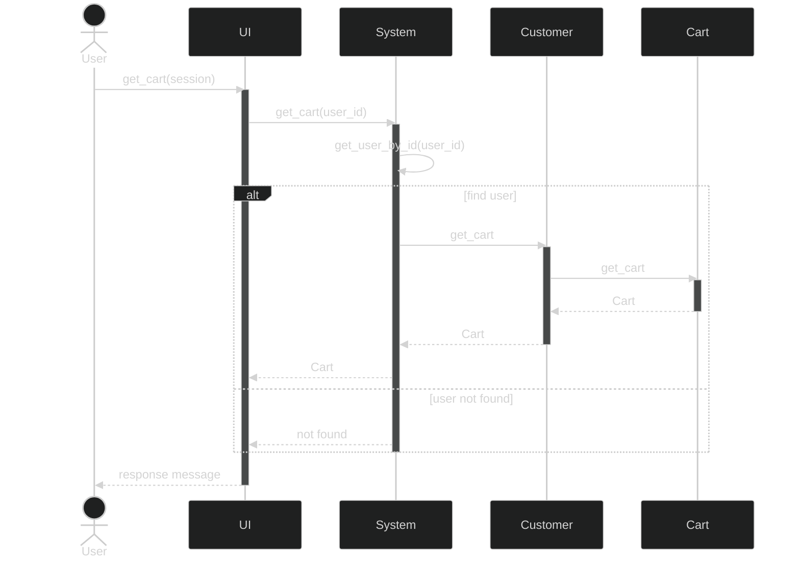

```mermaid
---
config:
  theme: dark
  look: classic
---

sequenceDiagram
    actor User
    participant UI
    participant System
    participant Customer
    participant Cart

    User ->> UI: get_cart(session)
    activate UI
    UI ->> System: get_cart(user_id)
    activate System
    System ->> System : get_user_by_id(user_id)
    alt find user
        System ->> Customer: get_cart
        activate Customer
        Customer ->> Cart: get_cart
        activate Cart
        Cart -->> Customer: Cart
        deactivate Cart
        Customer -->> System: Cart
        deactivate Customer
        System -->> UI: Cart
    else user not found
        System -->> UI : not found
    end
    deactivate System
    UI -->> User: response message
    deactivate UI
```
