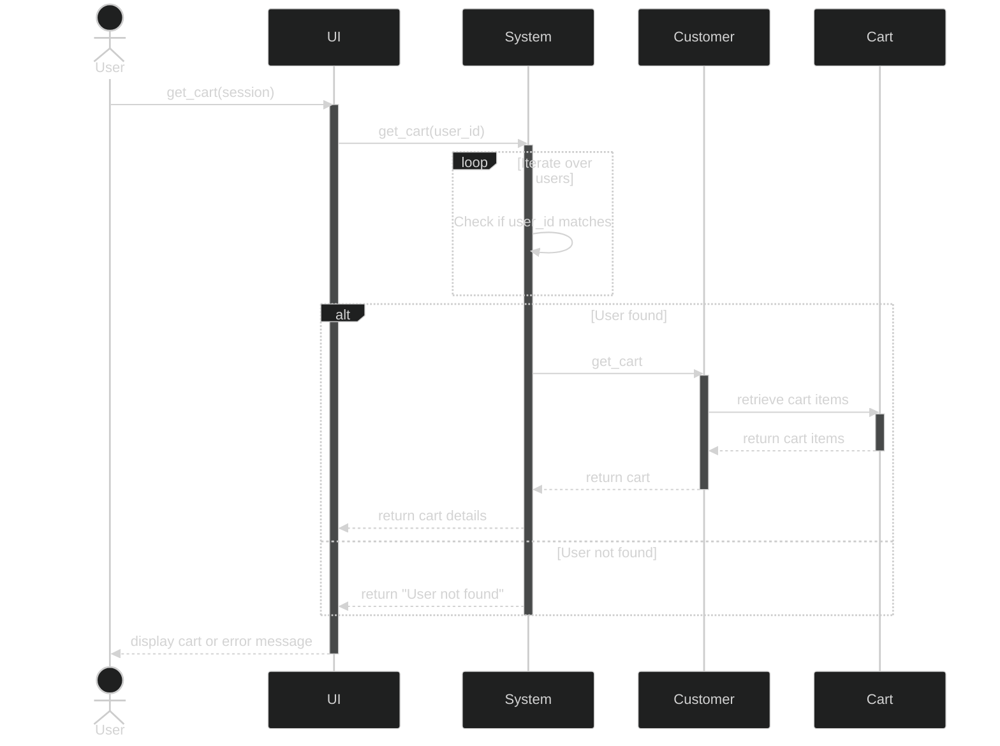

```mermaid
---
config:
  theme: dark
  look: classic
---

sequenceDiagram
    actor User
    participant UI
    participant System
    participant Customer
    participant Cart

    User ->> UI: get_cart(session)
    activate UI
    UI ->> System: get_cart(user_id)
    activate System

    loop Iterate over users
        System ->> System: Check if user_id matches
    end

    alt User found
        System ->> Customer: get_cart
        activate Customer
        Customer ->> Cart: retrieve cart items
        activate Cart
        Cart -->> Customer: return cart items
        deactivate Cart
        Customer -->> System: return cart
        deactivate Customer
        System -->> UI: return cart details
    else User not found
        System -->> UI: return "User not found"
    end

    deactivate System
    UI -->> User: display cart or error message
    deactivate UI
```
