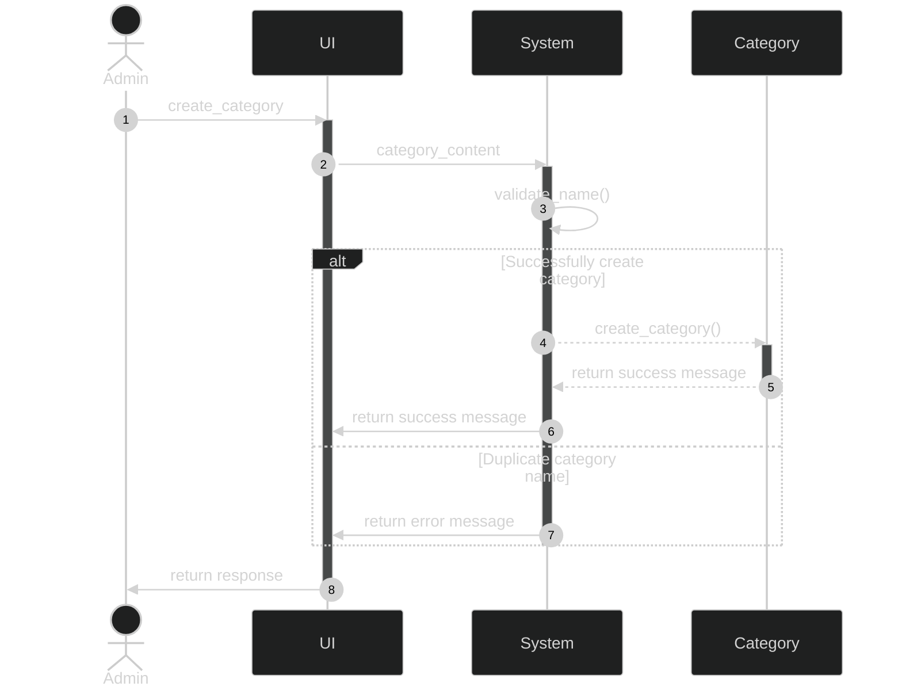

```mermaid
---
config:
  theme: dark
  look: classic
---

sequenceDiagram
autonumber

    actor Admin
    participant UI
    participant System
    participant Category

    Admin ->> UI: create_category
    activate UI
    UI ->> System: category_content
    activate System

    System ->> System: validate_name()
    alt Successfully create category
        System -->> Category: create_category()
        activate Category
        Category -->> System: return success message
        deactivate Category
        System ->> UI: return success message
    else Duplicate category name
        System ->> UI: return error message
    end
    deactivate System
    UI ->> Admin : return response
    deactivate UI
```
