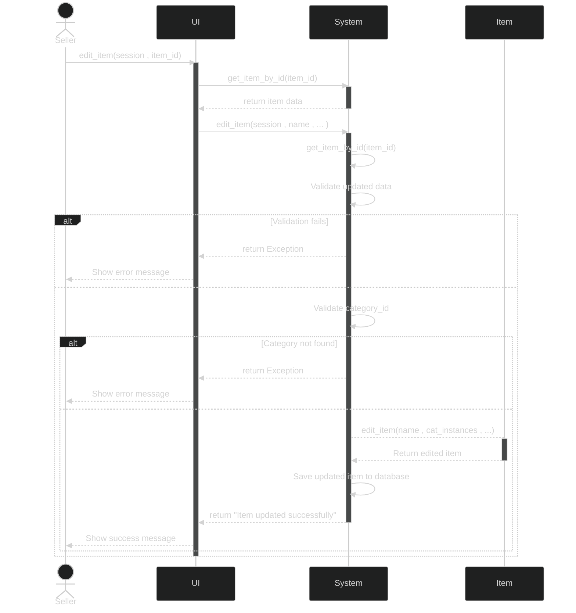

```mermaid
---
config:
  theme: dark
  look: classic
---

sequenceDiagram
    actor Seller
    participant UI
    participant System
    participant Item


    Seller ->> UI : edit_item(session , item_id)
    activate UI
    UI ->> System : get_item_by_id(item_id)
    activate System
    System -->> UI : return item data
    deactivate System

    UI ->> System : edit_item(session , name , ... )
    activate System
    System ->> System : get_item_by_id(item_id)

    System ->> System : Validate updated data
    alt Validation fails
        System -->> UI : return Exception
        UI -->> Seller : Show error message
    else
        System ->> System : Validate category_id
        alt Category not found
            System -->> UI :return Exception
            UI -->> Seller : Show error message
        else
            System --> Item : edit_item(name , cat_instances , ...)
            activate Item
            Item -->> System : Return edited item
            deactivate Item

            System ->> System : Save updated item to database
            System -->> UI : return "Item updated successfully"
                deactivate System

            UI -->> Seller : Show success message
        end
    end
    deactivate UI
```
