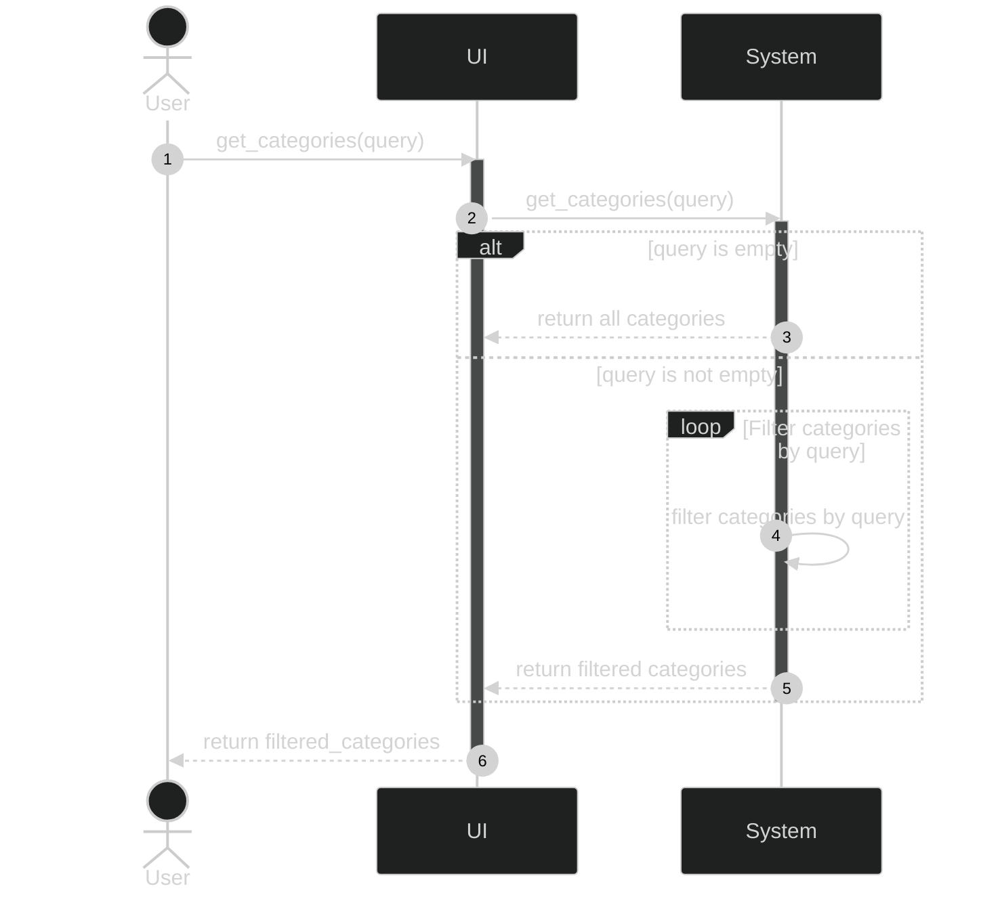

```mermaid
---
config:
  theme: dark
  look: classic
---

sequenceDiagram
autonumber

    actor User
    participant UI
    participant System

    User ->> UI: get_categories(query)
    activate UI
    UI ->> System: get_categories(query)
    activate System

    alt query is empty
        System -->> UI: return all categories
    else query is not empty
        loop Filter categories by query
            System ->> System: filter categories by query
        end
        System -->> UI: return filtered categories
    end

    deactivate System
    UI -->> User: return filtered_categories
    deactivate UI
```
