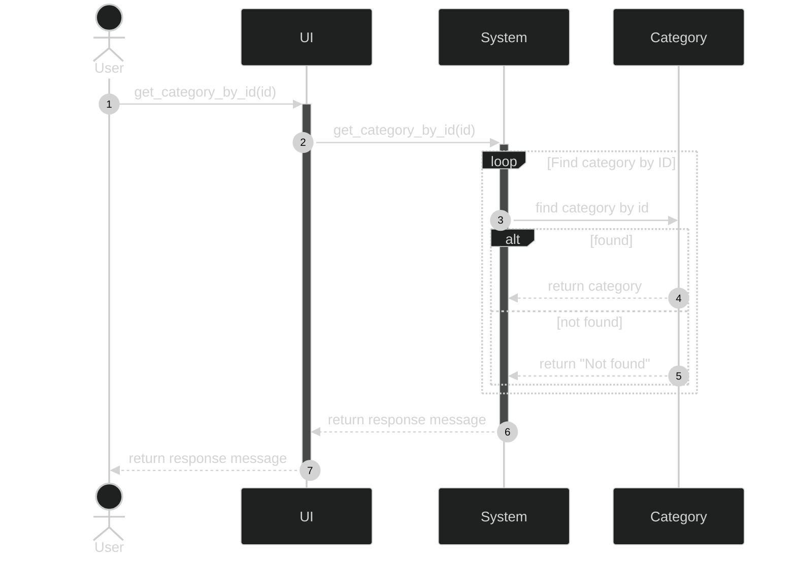

```mermaid
---
config:
  theme: dark
  look: classic
---
sequenceDiagram
  actor User as User
  participant UI as UI
  participant System as System
  participant Category as Category
  autonumber
  User ->>+ UI: get_category_by_id(id)
  UI ->>+ System: get_category_by_id(id)
  loop Find category by ID
    System ->> Category: find category by id
    alt found
      Category -->> System: return category
    else not found
      Category -->> System: return "Not found"
    end
  end
  System -->>- UI: return response message
  UI -->>- User: return response message
```
