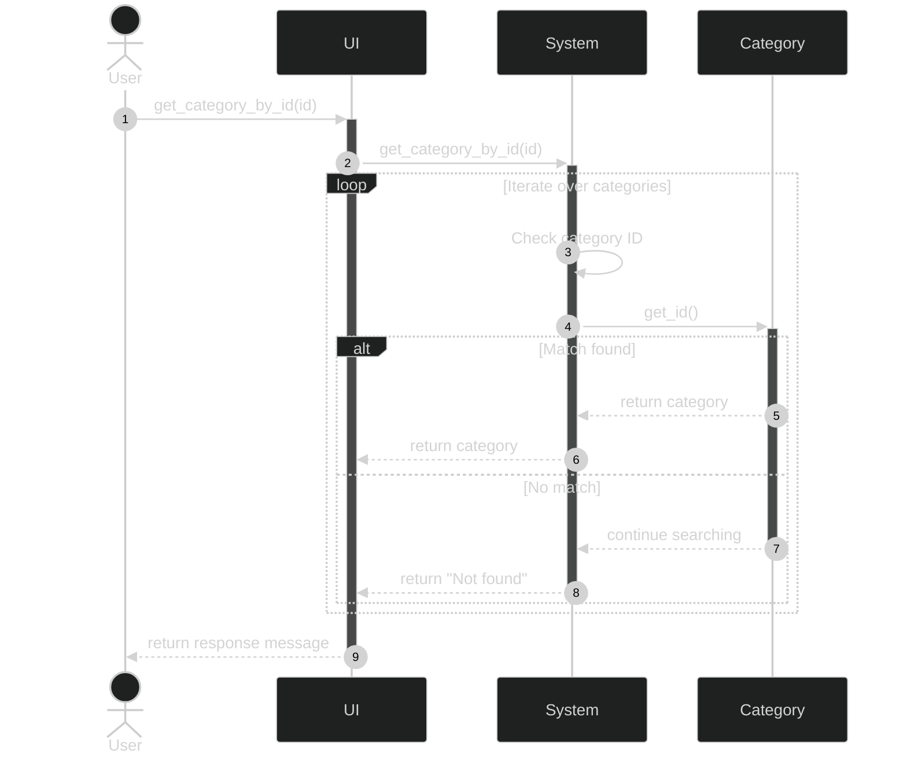

```mermaid
---
config:
  theme: dark
  look: classic
---
sequenceDiagram
  actor User as User
  participant UI as UI
  participant System as System
  participant Category as Category
  autonumber
  User ->>+ UI: get_category_by_id(id)
  UI ->>+ System: get_category_by_id(id)
  loop Iterate over categories
      System ->> System: Check category ID
      System ->>+ Category: get_id()
      alt Match found
          Category -->> System: return category
          System -->> UI: return category
      else No match
          Category -->>- System: continue searching
          System -->>- UI: return "Not found"
      end
  end
  UI -->>- User: return response message
```
