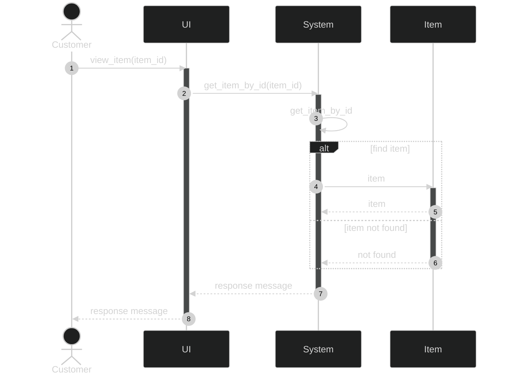

```mermaid
---
config:
  theme: dark
  look: classic
---
sequenceDiagram
autonumber

    actor Customer
    participant UI
    participant System
    participant Item

    Customer ->> UI: view_item(item_id)
    activate UI
    UI ->> System: get_item_by_id(item_id)
    activate System
    System ->> System : get_item_by_id
    alt find item
    System ->> Item: item
    activate Item
    Item -->> System: item
    else item not found
    Item -->> System: not found
    deactivate Item
    end
    System -->> UI: response message
    deactivate System
    UI -->> Customer: response message
    deactivate UI
```
