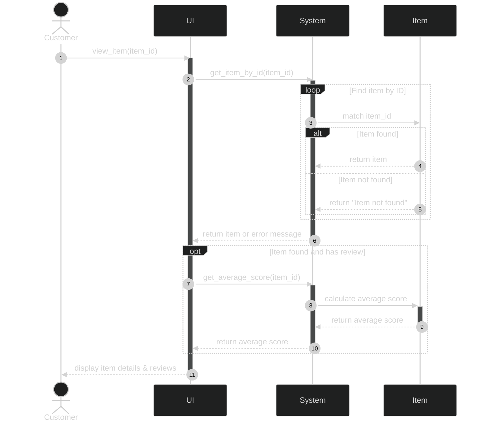

```mermaid
---
config:
  theme: dark
  look: classic
---
sequenceDiagram
autonumber

    actor Customer
    participant UI
    participant System
    participant Item

    Customer ->> UI: view_item(item_id)
    activate UI
    UI ->> System: get_item_by_id(item_id)
    activate System

    loop Find item by ID
        System ->> Item: match item_id
        alt Item found
            Item -->> System: return item
        else Item not found
            Item -->> System: return "Item not found"
        end
    end

    System -->> UI: return item or error message
    deactivate System

    opt Item found and has review
        UI ->> System: get_average_score(item_id)
        activate System

        System ->>+ Item: calculate average score
        Item -->>- System: return average score

        System -->> UI: return average score
        deactivate System
    end

    UI -->> Customer: display item details & reviews
    deactivate UI

```
