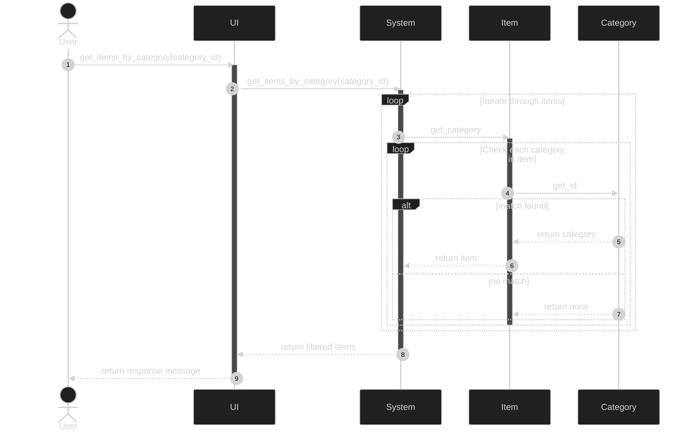

```mermaid
---
config:
  theme: dark
  look: classic
---

sequenceDiagram
autonumber

    actor User
    participant UI
    participant System
    participant Item
    participant Category

    User ->> UI: get_items_by_category(category_id)
    activate UI
    UI ->> System: get_items_by_category(category_id)
    activate System

    loop Iterate through items
        System ->> Item: get_category
        activate Item
        loop Check each category in item
            Item ->> Category: get_id
            alt match found
                Category -->> Item: return category
                Item -->> System: return item
            else no match
                Category -->> Item: return none
            end
        end
        deactivate Item
    end
    System -->> UI: return filtered items

    deactivate System
    UI -->> User: return response message
    deactivate UI
```
