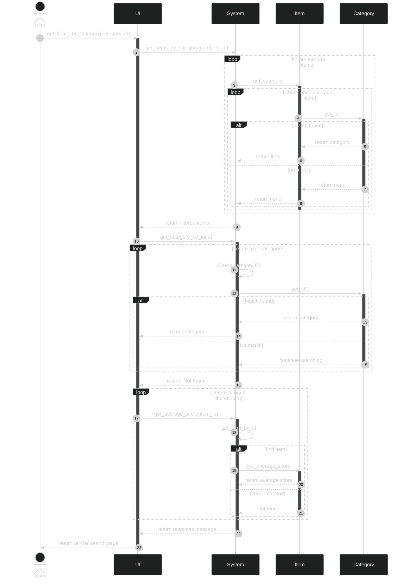

```mermaid
---
config:
  theme: dark
  look: classic
---
sequenceDiagram
autonumber

    actor User
    participant UI
    participant System
    participant Item
    participant Category

    User ->> UI: get_items_by_category(category_id)
    activate UI
    UI ->> System: get_items_by_category(category_id)
    activate System

    loop Iterate through items
        System ->> Item: get_category
        activate Item
        loop Check each category in item
            Item ->>+ Category: get_id
            alt match found
                Category -->> Item: return category
                Item -->> System: return item
            else no match
                Category -->>- Item: return none
                Item -->> System: return none
            end
        end
        deactivate Item
    end
    System -->> UI: return filtered items

    UI ->>+ System: get_category_by_id(id)
    loop Iterate over categories
        System ->> System: Check category ID
        System ->>+ Category: get_id()
        alt Match found
            Category -->> System: return category
            System -->> UI: return category
        else No match
            Category -->>- System: continue searching
        end
    end
    System -->>- UI: return "Not found"
    loop iterate through filtered item
        UI ->>+ System : get_average_score(item_id)
        System ->> System : get_item_by_id
        alt find item
        System ->> Item: get_average_score
        activate Item
        Item -->> System: return average score
        else item not found
        Item -->> System: not found
        deactivate Item
        end
    end

    System -->>- UI: return response message

    UI -->> User: return render search page
    deactivate UI
```
