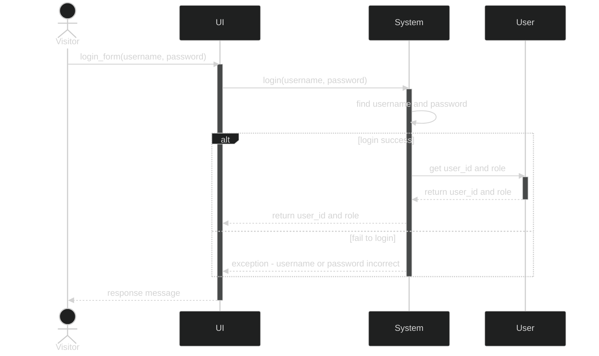

```mermaid
---
config:
  theme: dark
  look: classic
---

sequenceDiagram
actor Visitor
participant UI
participant System
participant User

    Visitor ->> UI: login_form(username, password)
    activate UI
    UI ->> System: login(username, password)
    activate System
    System ->> System: find username and password

    alt login success
        System ->> User: get user_id and role
        activate User
        User -->> System: return user_id and role
        deactivate User
        System -->> UI: return user_id and role
    else fail to login
        System -->> UI: exception - username or password incorrect
    end

    deactivate System
    UI -->> Visitor: response message
    deactivate UI
```
