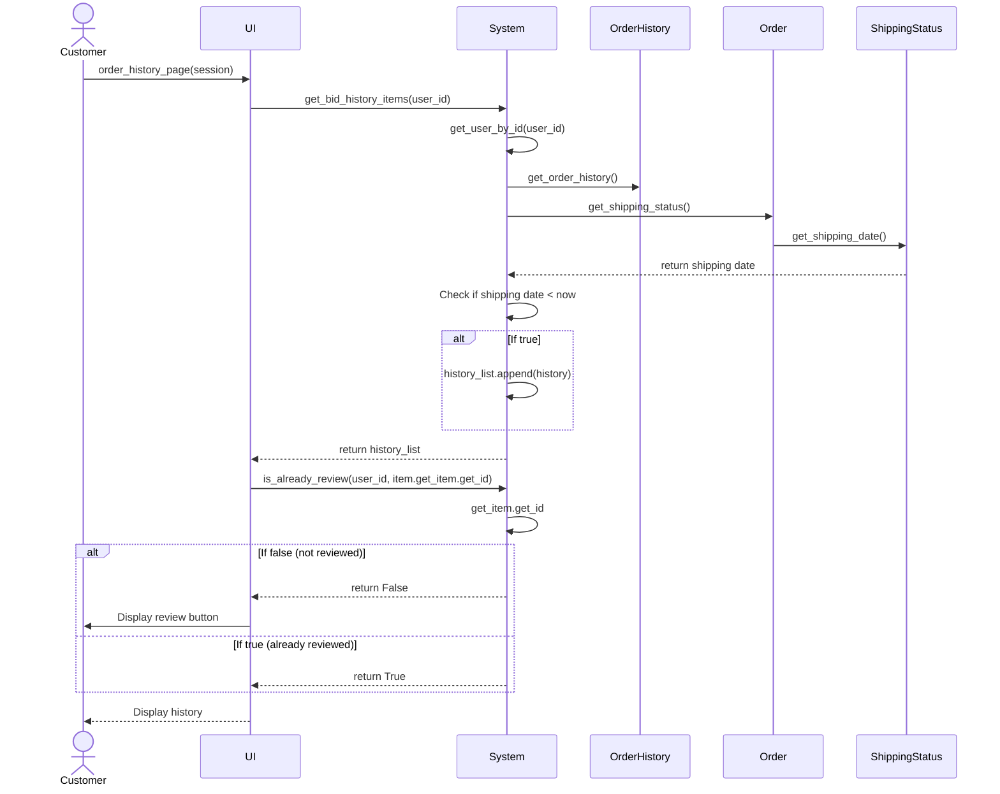

```mermaid
sequenceDiagram
    actor Customer
    participant UI
    participant System
    participant OrderHistory
    participant Order
    participant ShippingStatus

    Customer ->> UI: order_history_page(session)
    UI ->> System: get_bid_history_items(user_id)
    System ->> System: get_user_by_id(user_id)
    System ->> OrderHistory: get_order_history()
    
   
        System ->> Order: get_shipping_status()
        Order ->> ShippingStatus: get_shipping_date()
        ShippingStatus -->> System: return shipping date
        System ->> System: Check if shipping date < now
        alt If true
            System ->> System: history_list.append(history)
        end

    System -->> UI: return history_list

    UI ->> System: is_already_review(user_id, item.get_item.get_id)
        System ->> System : get_item.get_id
        alt If false (not reviewed)
            System -->> UI: return False
            UI ->> Customer: Display review button
        else If true (already reviewed)
            System -->> UI: return True
        end
    
    

    UI -->> Customer: Display history

```