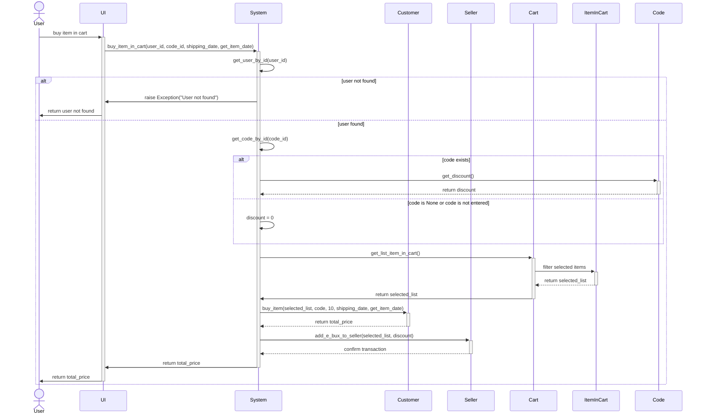

```mermaid
---
config:
  look: classic
---

sequenceDiagram
    actor User
    participant UI
    participant System
    participant Customer
    participant Seller
    participant Cart
    participant ItemInCart
    participant Code

    User ->>+ UI: buy item in cart
    UI ->>+ System: buy_item_in_cart(user_id, code_id, shipping_date, get_item_date)

    System ->> System: get_user_by_id(user_id)
    alt user not found
        System ->> UI: raise Exception("User not found")
        UI ->> User: return user not found
    else user found
        System ->> System: get_code_by_id(code_id)
        
        alt code exists
            System ->>+ Code: get_discount()
            Code -->>- System: return discount
        else code is None or code is not entered
            System ->> System: discount = 0
        end
        
        System ->>+ Cart: get_list_item_in_cart()
        Cart ->>+ ItemInCart: filter selected items
        ItemInCart -->>- Cart: return selected_list
        Cart ->>- System: return selected_list
        
        
        System ->>+ Customer: buy_item(selected_list, code, 10, shipping_date, get_item_date)
        Customer -->>- System: return total_price
        
        System ->>+ Seller: add_e_bux_to_seller(selected_list, discount)
        Seller -->>- System: confirm transaction
        
        System ->>- UI: return total_price
        UI ->>- User: return total_price
    end

```