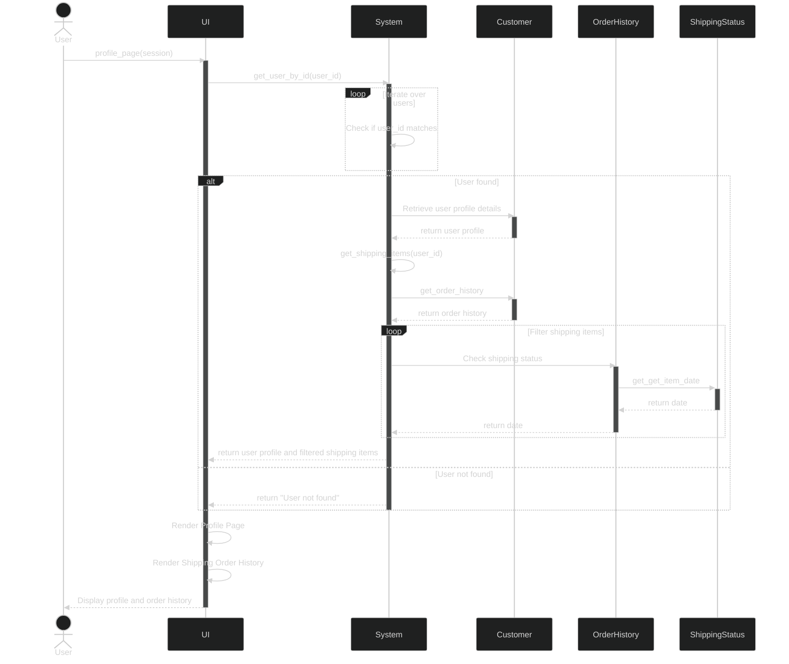

```mermaid
---
config:
  theme: dark
  look: classic
---
sequenceDiagram
    actor User
    participant UI
    participant System
    participant Customer
    participant OrderHistory
    participant ShippingStatus

    User ->> UI: profile_page(session)
    activate UI

    UI ->> System: get_user_by_id(user_id)
    activate System

    loop Iterate over users
        System ->> System: Check if user_id matches
    end

    alt User found
        System ->> Customer: Retrieve user profile details
        activate Customer
        Customer -->> System: return user profile
        deactivate Customer

        System ->> System: get_shipping_items(user_id)

        System ->> Customer: get_order_history
        activate Customer
        Customer -->> System: return order history
        deactivate Customer

        loop Filter shipping items
            System ->> OrderHistory: Check shipping status
            activate OrderHistory
            OrderHistory ->>+ ShippingStatus: get_get_item_date
            ShippingStatus -->>- OrderHistory: return date
            OrderHistory -->> System : return date
            deactivate OrderHistory
        end

        System -->> UI: return user profile and filtered shipping items
    else User not found
        System -->> UI: return "User not found"
    end

    deactivate System

    UI ->> UI: Render Profile Page
    UI ->> UI: Render Shipping Order History
    UI -->> User: Display profile and order history
    deactivate UI
```
