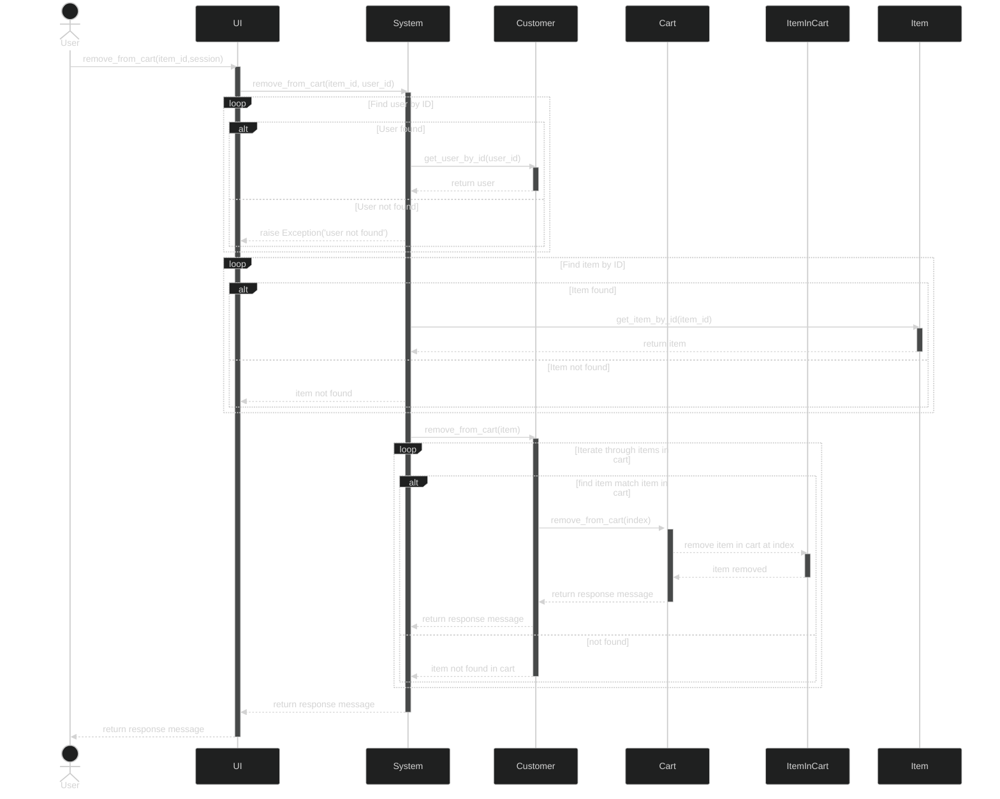

```mermaid
---
config:
  theme: dark
  look: classic
---

sequenceDiagram
    actor User
    participant UI
    participant System
    participant Customer
    participant Cart
    participant ItemInCart
    User ->> UI: remove_from_cart(item_id,session)
    activate UI
    UI->>System: remove_from_cart(item_id, user_id)
    activate System
    loop Find user by ID
        alt User found
            System->>Customer: get_user_by_id(user_id)
            activate Customer
            Customer-->>System: return user
            deactivate Customer
        else User not found
            System-->>UI: raise Exception('user not found')
        end
    end
    loop Find item by ID
        alt Item found
            System->>Item: get_item_by_id(item_id)
            activate Item
            Item-->>System: return item
            deactivate Item
        else Item not found
            System-->>UI:item not found
        end
    end
    System->>Customer: remove_from_cart(item)
    activate Customer
    activate Cart
    loop Iterate through items in cart
        alt find item match item in cart
        Customer->>Cart: remove_from_cart(index)
        activate Cart
        Cart -->> ItemInCart: remove item in cart at index
        activate ItemInCart
        ItemInCart -->> Cart:item removed
        deactivate ItemInCart
        Cart -->> Customer:return response message
        deactivate Cart
        Customer -->> System: return response message
        else not found
        Customer -->> System: item not found in cart
        deactivate Customer
        end
    end
    System-->>UI: return response message
    deactivate System
    UI -->> User:return response message
    deactivate UI
```
