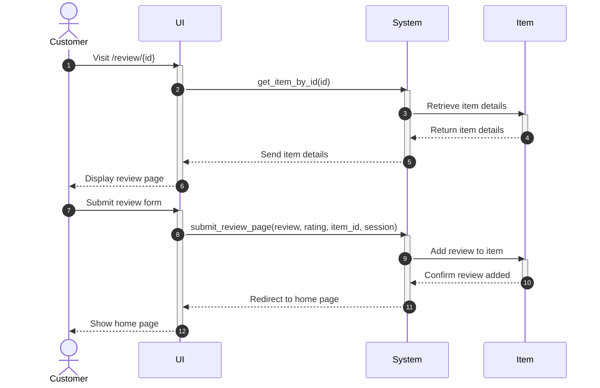

```mermaid
sequenceDiagram
  autonumber
  actor Customer as Customer
  participant UI as UI
  participant System as System
  participant Item as Item

  Customer->>UI: Visit /review/{id}
  activate UI
  UI->>System: get_item_by_id(id)
  activate System
  System->>Item: Retrieve item details
  activate Item
  Item-->>System: Return item details
  deactivate Item
  System-->>UI: Send item details
  deactivate System
  UI-->>Customer: Display review page
  deactivate UI

  Customer->>UI: Submit review form
  activate UI
  UI->>System: submit_review_page(review, rating, item_id, session)
  activate System
  System->>Item: Add review to item
  activate Item
  Item-->>System: Confirm review added
  deactivate Item
  System-->>UI: Redirect to home page
  deactivate System
  UI-->>Customer: Show home page
  deactivate UI
```
