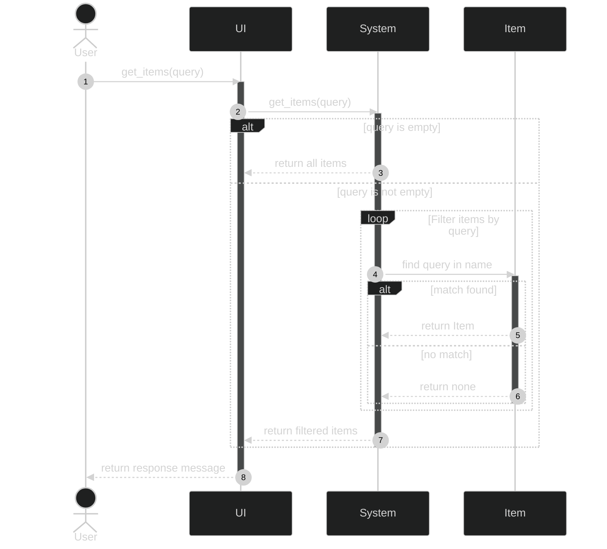

```mermaid
---
config:
  theme: dark
  look: classic
---

sequenceDiagram
autonumber

    actor User
    participant UI
    participant System
    participant Item

    User ->> UI: get_items(query)
    activate UI
    UI ->> System: get_items(query)
    activate System

    alt query is empty
        System -->> UI: return all items
    else query is not empty
        loop Filter items by query
            System ->> Item: find query in name
            activate Item
            alt match found
                Item -->> System: return Item
            else no match
                Item -->> System: return none
            end
            deactivate Item
        end
        System -->> UI: return filtered items
    end

    deactivate System
    UI -->> User: return response message
    deactivate UI
```
