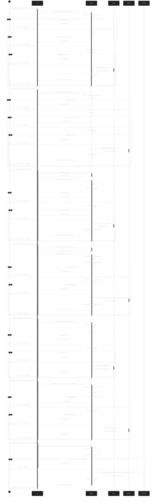

```mermaid
---
config:
  theme: dark
  look: classic
---
sequenceDiagram
    actor Seller
    participant UI
    participant System
    participant Item
    participant bidItem

     Seller ->> UI : submit_product_page (product , session)
    activate UI
    UI ->> System : save_item(user_id, product.name , ... )
    activate System
    System ->> System : validate_name(name, list_items)
    alt Item already exists
        System -->> UI :  return Exception
        UI -->> Seller : Show error message
    else
        System ->> System : Check role
        alt User is not a seller
            System -->> UI :  return Exception
            UI -->> Seller : Show error message
        else
            System ->> System : Validate category_id
            alt Category not found
                System -->> UI :  return Exception
                UI -->> Seller : Show error message
            else
                System ->> Item : create_item(id, name , ...)
                activate Item
                Item -->> System : Return created item
                deactivate Item
                System ->> System : list_item.append(Item)
                System -->> UI : return 'Item saved successfully'
                UI -->> Seller : Show success message
            end
        end
    end
    deactivate System
    deactivate UI

    Seller ->> UI : submit_bid_product_page (product , session)
    activate UI
    UI ->> System : save_bid_item(user_id, product.name , ... )
    activate System
    System ->> System : validate_name(name, list_items)
    alt Item already exists
        System -->> UI :  return Exception
        UI -->> Seller : Show error message
    else
        System ->> System : Check role
        alt User is not a seller
            System -->> UI :  return Exception
            UI -->> Seller : Show error message
        else
            System ->> System : Validate category_id
            alt Category not found
                System -->> UI : return Exception
                UI -->> Seller : Show error message
            else
                System ->> bidItem : create_bid_item(id, name , ...)
                activate bidItem
                bidItem -->> System : Return created bid item
                deactivate bidItem
                System ->> System : list_item.append(Item)
                System -->> UI : return 'Bid Item saved successfully'
                UI -->> Seller : Show success message
            end
        end
    end


    Seller ->> UI : edit_item(session , item_id)
    activate UI
    UI ->> System : get_item_by_id(item_id)
    activate System
    System -->> UI : return item data
    deactivate System

    UI ->> System : edit_item(session , name , ... )
    activate System
    System ->> System : get_item_by_id(item_id)

    System ->> System : Validate updated data
    alt Validation fails
        System -->> UI : return Exception
        UI -->> Seller : Show error message
    else
        System ->> System : Validate category_id
        alt Category not found
            System -->> UI :return Exception
            UI -->> Seller : Show error message
        else
            System --> Item : edit_item(name , cat_instances , ...)
            activate Item
            Item -->> System : Return edited item
            deactivate Item

            System ->> System : Save updated item to database
            System -->> UI : return "Item updated successfully"
            UI -->> Seller : Show success message
        end
    end
    deactivate System
    deactivate UI

    Seller ->> UI : edit_bid_item(session , bid_item_id)
    activate UI
    UI ->> System : get_bid_item_by_id(bid_item_id)
    activate System
    System -->> UI : Return bid item data
    deactivate System

    UI ->> System : edit_bid_item(session , name , ... )
    activate System
    System ->> System : get_bid_item_by_id(bid_item_id)

    System ->> System : validate updated bid item data
    alt Validation fails
        System -->> UI :  return Exception
        UI -->> Seller : show error message
    else
        System ->> System : validate minimum bid amount
        alt Invalid bid amount
            System -->> UI :  return Exception
            UI -->> Seller : show error message
        else
            System --> bidItem : edit_bid_item(name , price , category , description , img , start_time , end_time)
            activate bidItem
            bidItem -->> System : return edited bid item
            deactivate bidItem

            System ->> System : save updated bid item to database
            System -->> UI :  return "Item updated successfully"
            UI -->> Seller : show success message
        end
    end
    deactivate System
    deactivate UI

    Seller ->> UI : update_stock(stock_product , session)
    activate UI
    UI ->> System : add_stock(user_id, item_id, amount)
    activate System
    System ->> System : get_item_by_id(item_id)

    System ->> System : validate item
    alt Validation fails
        System -->> UI : return Exception
        UI -->> Seller : show error message
    else
        System ->> System : Validate stock amount
        alt Invalid stock amount
            System -->> UI : return Exception
            UI -->> Seller : Show error message
        else
            System ->> Item : add_amount(amount)
            activate Item
            Item ->> System : Return updated item
            deactivate Item
            System -->> UI : return 'Success'
            UI -->> Seller : Show success message
        end
    end
    deactivate System
    deactivate UI

    Seller ->> UI : update_bid_stock(bid_stock_product , session)
    activate UI
    UI ->> System : add_bid_stock(user_id, bid_item_id, amount)
    activate System
    System ->> System : get_bid_item_by_id(bid_item_id)

    System ->> System : validate bid item
    alt Validation fails
        System -->> UI : return Exception
        UI -->> Seller : Show error message
    else
        System ->> System : validate bid stock amount
        alt Invalid bid stock amount
            System -->> UI : return Exception
            UI -->> Seller : Show error message
        else
            System ->> bidItem : add_amount(amount)
            activate bidItem
            bidItem -->> System : return updated bid item
            deactivate bidItem
            System -->> UI : return Exception
            UI -->> Seller : Show success message
        end
    end

    deactivate System
    deactivate UI

    Seller ->> UI : submit_discount_page(discount_code, session)
    activate UI

    UI ->> System : save_discount_code(discount_code.name, discount_code.discount_percentage, discount_code.detail)
    activate System

    System ->> System : generate discount ID id = uuid4
    System ->> System : validate discount percentage

    alt Discount percent is invalid
        System -->> UI : return Exception
        UI -->> Seller : Show error message
        deactivate UI
    else
        System ->> Discount : create_discount_code(ID, name, discount_percent, description)
        Discount -->> System : return discount code
        System ->> System : append discount to list
        System -->> UI : return success message
        deactivate System
        UI -->> Seller : return "Discount code saved successfully"
        deactivate UI
    end


```
