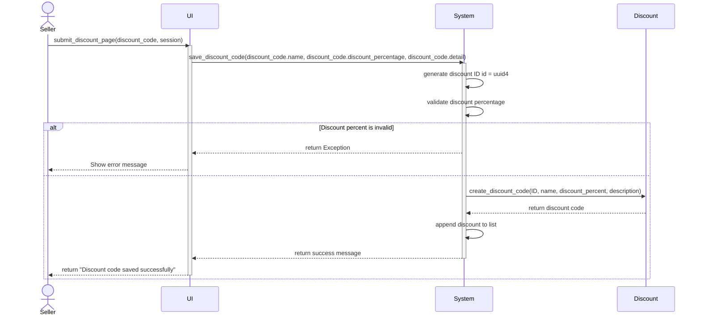

```mermaid
sequenceDiagram
    actor Seller
    participant UI
    participant System
    participant Discount


    Seller ->> UI : submit_discount_page(discount_code, session)
    activate UI

    UI ->> System : save_discount_code(discount_code.name, discount_code.discount_percentage, discount_code.detail)
    activate System

    System ->> System : generate discount ID id = uuid4
    System ->> System : validate discount percentage

    alt Discount percent is invalid
        System -->> UI : return Exception
        UI -->> Seller : Show error message
    else
        System ->> Discount : create_discount_code(ID, name, discount_percent, description)
        Discount -->> System : return discount code
        System ->> System : append discount to list
        System -->> UI : return success message
        deactivate System
        UI -->> Seller : return "Discount code saved successfully"
        deactivate UI
    end
```
