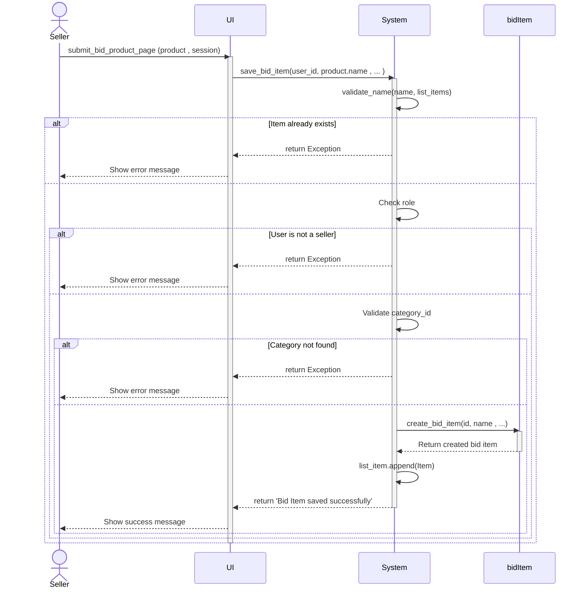

```mermaid

sequenceDiagram
   actor Seller
   participant UI
   participant System
   participant bidItem


Seller ->> UI : submit_bid_product_page (product , session)
   activate UI
   UI ->> System : save_bid_item(user_id, product.name , ... )
   activate System
   System ->> System : validate_name(name, list_items)
   alt Item already exists
       System -->> UI :  return Exception
       UI -->> Seller : Show error message
   else
       System ->> System : Check role
       alt User is not a seller
           System -->> UI :  return Exception
           UI -->> Seller : Show error message
       else
           System ->> System : Validate category_id
           alt Category not found
               System -->> UI : return Exception
               UI -->> Seller : Show error message
           else
               System ->> bidItem : create_bid_item(id, name , ...)
               activate bidItem
               bidItem -->> System : Return created bid item
               deactivate bidItem
               System ->> System : list_item.append(Item)
               System -->> UI : return 'Bid Item saved successfully'
                deactivate System
               UI -->> Seller : Show success message
           end
       end

   end
   deactivate UI

```
