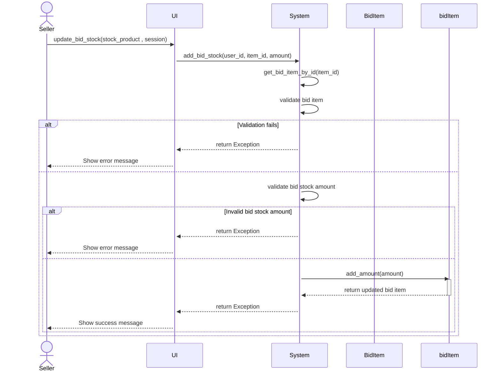

```mermaid
sequenceDiagram
    actor Seller
    participant UI
    participant System
    participant BidItem

 Seller ->> UI : update_bid_stock(stock_product , session)
    activate UI
    UI ->> System : add_bid_stock(user_id, item_id, amount)
    activate System
    System ->> System : get_bid_item_by_id(item_id)


 System ->> System : validate bid item
    alt Validation fails
        System -->> UI : return Exception
        UI -->> Seller : Show error message
    else
        System ->> System : validate bid stock amount
        alt Invalid bid stock amount
            System -->> UI : return Exception
            UI -->> Seller : Show error message
        else
            System ->> bidItem : add_amount(amount)
            activate bidItem
            bidItem -->> System : return updated bid item
            deactivate bidItem
            System -->> UI : return Exception
            UI -->> Seller : Show success message
        end
    end
```