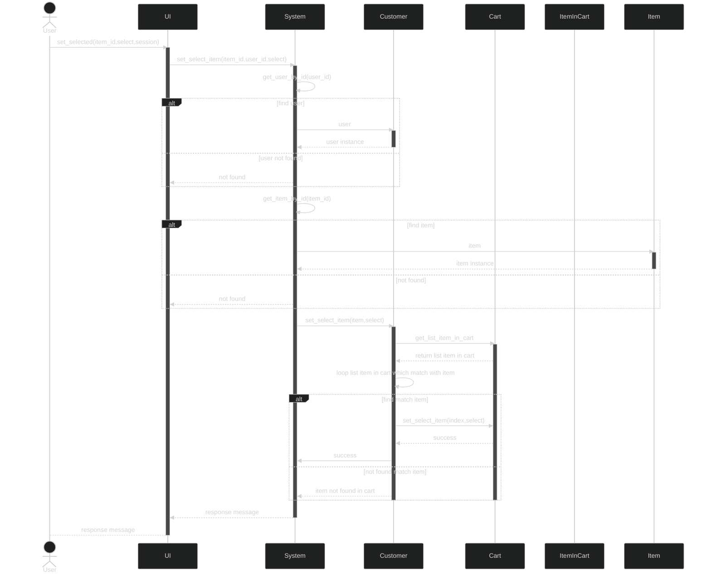

```mermaid
---
config:
  theme: dark
  look: classic
---

sequenceDiagram
    actor User
    participant UI
    participant System
    participant Customer
    participant Cart
    participant ItemInCart
    participant Item
    User ->>  UI: set_selected(item_id,select,session)
    activate UI
    UI ->> System: set_select_item(item_id,user_id,select)
    activate System
    System ->> System : get_user_by_id(user_id)
    alt find user
    System ->> Customer: user
    activate Customer
    Customer -->> System: user instance
    deactivate Customer
    else user not found
    System -->> UI : not found
    end
    System ->> System :get_item_by_id(item_id)
    alt find item
    System ->> Item: item
    activate Item
    Item -->> System:item instance
    deactivate Item
    else not found
    System -->> UI : not found
    end
    System ->> Customer: set_select_item(item,select)
    activate Customer
    Customer ->> Cart: get_list_item_in_cart
    activate Cart
    Cart -->> Customer: return list item in cart
    Customer ->> Customer: loop list item in cart which match with item
    alt find match item
        Customer ->> Cart: set_select_item(index,select)
        Cart -->> Customer: success
        Customer ->> System :success
    else not found match item
        Customer -->> System: item not found in cart
    end
    deactivate Cart
    deactivate Customer
    System -->> UI : response message

    deactivate System
    UI --> User: response message
    deactivate UI
```
