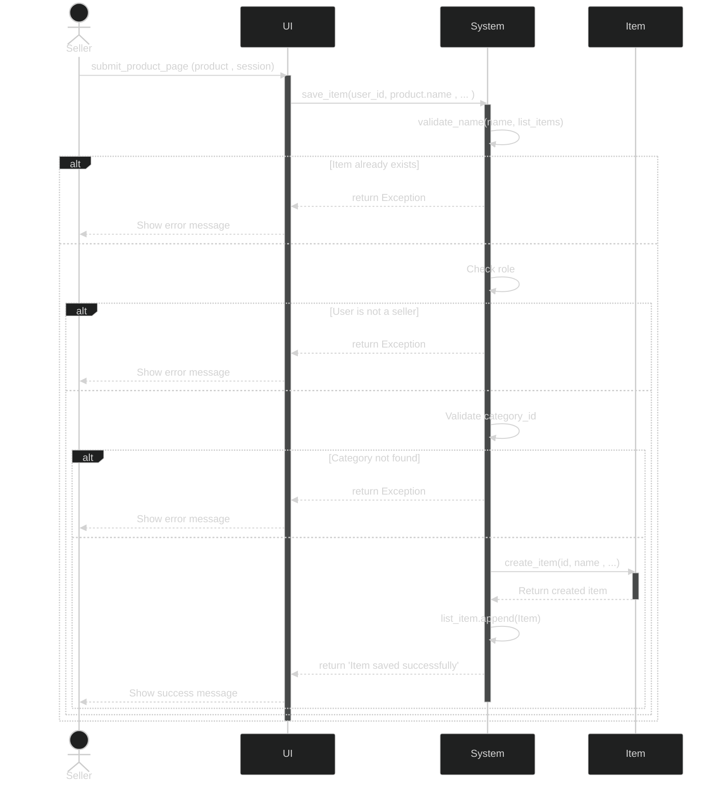

```mermaid
---
config:
  theme: dark
  look: classic
---
sequenceDiagram
    actor Seller
    participant UI
    participant System
    participant Item

     Seller ->> UI : submit_product_page (product , session)
    activate UI
    UI ->> System : save_item(user_id, product.name , ... )
    activate System
    System ->> System : validate_name(name, list_items)
    alt Item already exists
        System -->> UI :  return Exception
        UI -->> Seller : Show error message
    else
        System ->> System : Check role
        alt User is not a seller
            System -->> UI :  return Exception
            UI -->> Seller : Show error message
        else
            System ->> System : Validate category_id
            alt Category not found
                System -->> UI :  return Exception
                UI -->> Seller : Show error message
            else
                System ->> Item : create_item(id, name , ...)
                activate Item
                Item -->> System : Return created item
                deactivate Item
                System ->> System : list_item.append(Item)
                System -->> UI : return 'Item saved successfully'
                UI -->> Seller : Show success message
                deactivate System
            end
        end
    end

    deactivate UI


```
