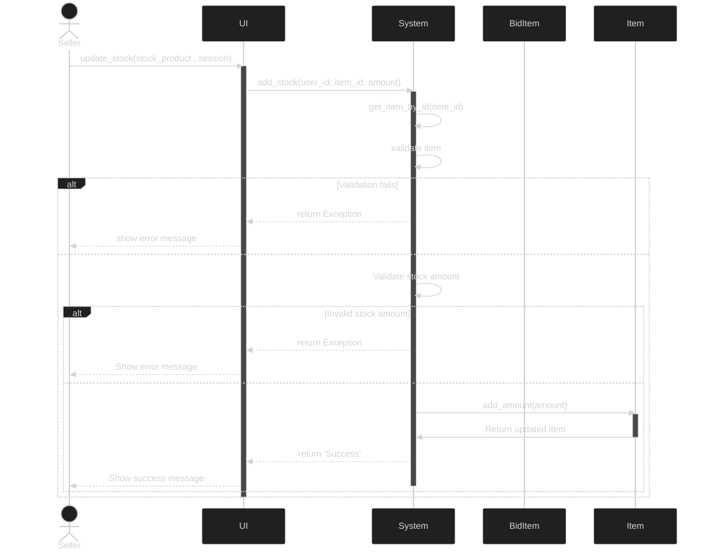

```mermaid
---
config:
  theme: dark
  look: classic
---
sequenceDiagram
    actor Seller
    participant UI
    participant System
    participant BidItem


    Seller ->> UI : update_stock(stock_product , session)
    activate UI
    UI ->> System : add_stock(user_id, item_id, amount)
    activate System
    System ->> System : get_item_by_id(item_id)

    System ->> System : validate item
    alt Validation fails
        System -->> UI : return Exception
        UI -->> Seller : show error message
    else
        System ->> System : Validate stock amount
        alt Invalid stock amount
            System -->> UI : return Exception
            UI -->> Seller : Show error message
        else
            System ->> Item : add_amount(amount)
            activate Item
            Item ->> System : Return updated item
            deactivate Item
            System -->> UI : return 'Success'
            UI -->> Seller : Show success message
                deactivate System

        end
    end
    deactivate UI
```
